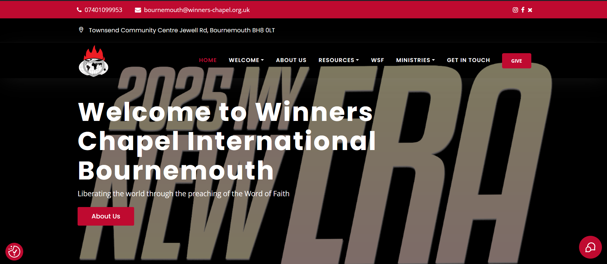
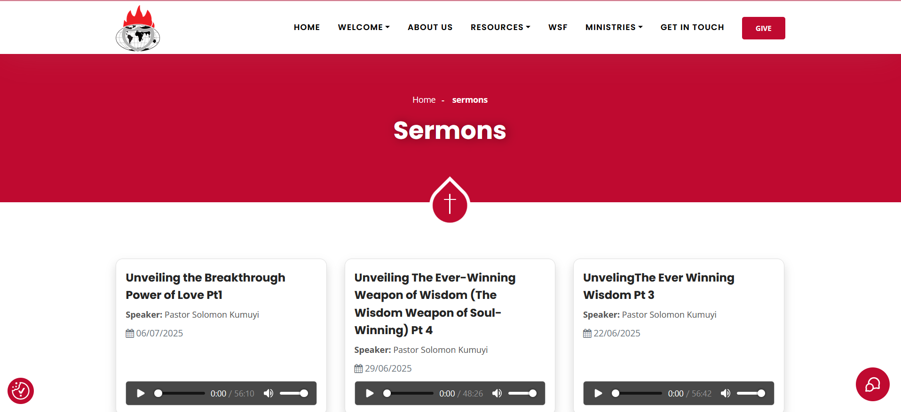

# Winners Chapel Bournemouth – Custom WordPress Theme

This is a custom WordPress theme developed from scratch for [Winners Chapel International Bournemouth](https://www.winnerschapelbournemouth.org.uk). The project aims to provide a modern, dynamic, and editable church website using clean code, flexible content management, and optimized performance.

## 🎯 Project Goals

- Replace static Elementor pages with dynamic ACF-managed sections.
- Improve site speed, maintainability, and SEO.
- Allow church admins to manage content like announcements, sermons, and testimonies.
- Enhance accessibility and user experience on all devices.

---

## 🛠️ Tech Stack

- **WordPress** (Custom Theme)
- **HTML5**, **CSS3**, **Bootstrap 5**
- **jQuery**, **AJAX**, **PHP**
- **ACF Pro** – Dynamic fields and repeater blocks
- **Owl Carousel** – Beautiful sliders
- **Google Places API** – Live review integration
- **LeadConnector** – Prayer, transport & testimony form handling

---

## 🚀 Key Features

- ✅ Responsive layout with Bootstrap 5
- ✅ Admin-editable sermons, announcements, and ministries
- ✅ Dynamic testimony & ministry sliders (Owl Carousel)
- ✅ Monthly Prophetic Focus management
- ✅ Countdown for upcoming events
- ✅ Integrated Google Reviews (live updates)
- ✅ Prayer & transport request forms (via LeadConnector)
- ✅ Custom tabbed ministries, WSF locator, and more

---

## 📂 Theme Structure

winnerschapel-bournemouth-theme/
├── css/
├── js/
├── images/
├── rs-plugin/
├── functions.php
├── header.php
├── footer.php
├── front-page.php
├── about-us.php
├── sermons.php
├── ...
└── style.css

📸 Screenshots

🧑‍💼 Admin Instructions

    Install & activate ACF Pro.

    Go to Custom Fields > Manage:

        Announcements

        Programs

        Testimonies

        Ministries

    Use the WordPress dashboard to add content dynamically.

⚙️ Setup Instructions

    Upload theme to /wp-content/themes/

    Activate it from WordPress Appearance > Themes

    Install required plugins:

        ACF Pro

        Revolution Slider (optional)

    Configure Google API key for Places 

🙏 Special Thanks

To the amazing Winners Chapel Bournemouth team and leadership for the opportunity to contribute to your digital transformation.

📜 License

This theme is for use by Winners Chapel International Bournemouth only and is not licensed for commercial distribution.

🔗 Live Website

👉 winnerschapelbournemouth.org.uk
